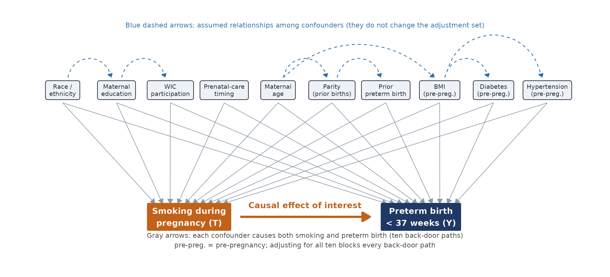
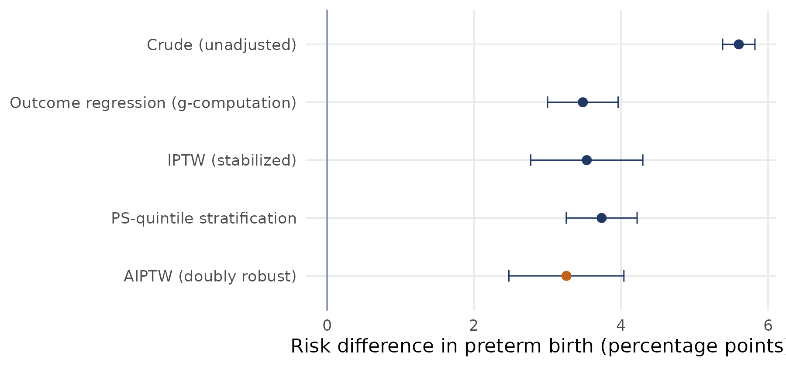

# Does smoking in pregnancy cause preterm birth? A doubly robust (AIPTW) analysis of 3.26 million U.S. births

SEASUG 2026: *Applying Propensity Score Matching to Evaluate Interventions*

**Authors:** Faruk Muritala and Dhrubajyoti Ghosh, Kennesaw State University

Everything needed to reproduce the paper is here: the paper, the slides, the R code, and the small data extract the code starts from. All numbers in the paper come from the code in this repository. The random seed is 1234.

## Problem statement

Mothers who smoke during pregnancy deliver preterm (before 37 completed weeks) more often than mothers who do not: 13.9% against 8.3% in the 2023 U.S. birth certificate data, a crude gap of 5.6 percentage points. But smokers also differ from non-smokers in age, education, race and ethnicity, prenatal care, income support (WIC), parity, previous preterm birth, diabetes, hypertension and BMI, and several of those also raise preterm risk. The crude gap therefore mixes the effect of smoking with the effect of who smokes.

**Question.** How much of the 5.6-point gap is caused by smoking itself? The target is the average treatment effect (ATE) on the risk difference scale: the preterm risk if every mother smoked minus the risk if none did.

**Why this matters.** Large U.S. analyses report adjusted odds ratios from regression. This project adds the effect on the absolute risk scale from a doubly robust estimator, with a causal diagram that documents the evidence for every arrow, a full overlap assessment, sensitivity analyses and an E-value, so the size of the effect, the strength of the assumptions and the stability of the answer can be read together.

## Data

2023 U.S. Natality Public Use File (NCHS, National Vital Statistics System), public use, no personal identifiers.

| Step | Births |
|---|---|
| Singleton live births with known gestational age and smoking status (extract) | 3,476,180 |
| After excluding mothers who are not U.S. residents | 3,467,679 |
| Complete data on all ten confounders (analytic cohort) | 3,259,496 |
| of which smoked during pregnancy | 97,187 (3.0%) |

- Official file (224 MB zip): https://ftp.cdc.gov/pub/Health_Statistics/NCHS/Datasets/DVS/natality/Nat2023us.zip
- User guide with all variable codes: https://ftp.cdc.gov/pub/Health_Statistics/NCHS/Dataset_Documentation/DVS/natality/UserGuide2023.pdf
- CSV version used here (NBER): https://data.nber.org/nvss/natality/csv/2023/natality2023us.zip
- The 24-column extract the code starts from is included: `code/data/nvss2023_extract.csv.gz` (36 MB).

## Methodology snapshot

**Causal diagram.** Treatment T is smoking during pregnancy (any reported smoking). Outcome Y is preterm birth (gestational age under 37 weeks). Ten confounders, each a documented cause of both T and Y: maternal age, race and ethnicity, education, timing of prenatal care, WIC participation, parity, previous preterm birth, pre-pregnancy diabetes, pre-pregnancy hypertension and pre-pregnancy BMI. Because every confounder is a direct parent of both T and Y, adjusting for all ten blocks every back-door path T <- X -> Y. Insurance type is left out of the main model and appears only in a sensitivity analysis. The paper gives the evidence for every arrow (Tables 2 and 3).



**Assumptions.** Conditional exchangeability given the ten confounders, positivity, consistency with no interference, and correct specification of at least one of the two models used by the estimator.

**Estimator.** AIPTW (Augmented IPTW), a doubly robust estimator. With propensity score e(X) = P(T = 1 | X) and outcome models mu_1(X), mu_0(X) fitted by logistic regression on the ten confounders:

```
psi1 = mean[ mu1(X) + T (Y - mu1(X)) / e(X) ]
psi0 = mean[ mu0(X) + (1 - T)(Y - mu0(X)) / (1 - e(X)) ]
ATE  = psi1 - psi0
```

The estimate is consistent if either the propensity model or the outcome models are correct. Standard errors come from the estimated influence function (delta method for the risk ratio and odds ratio) and were checked against a bootstrap on a 200,000-birth subsample.

**Why weighting and not matching.** Weighting keeps all 3.26 million births, while matching discards unmatched births and changes the population the estimate describes. Weighting targets the population-average effect directly, which is the stated estimand, and it gives variances from the influence function. The cost is sensitivity to very small propensity scores, which the analysis addresses with clamping, overlap diagnostics and sensitivity analyses.

**Comparison estimators.** Crude difference, outcome regression (g-computation), stabilized IPTW, propensity score stratification, and overlap weights as a check that does not depend on the tails.

**Diagnostics and sensitivity.** Overlap of propensity scores, standardized mean differences for 38 covariate levels, several propensity score handling rules, four alternative covariate specifications, exploratory subgroups, and an E-value.

## Main results

| Estimator | Risk difference, percentage points (95% CI) |
|---|---|
| Crude (unadjusted) | 5.60 (5.38, 5.82) |
| Outcome regression (g-computation) | 3.48 (3.00, 3.96) |
| Stabilized IPTW | 3.53 (2.77, 4.30) |
| Propensity score stratification | 3.74 (3.25, 4.22) |
| **AIPTW (doubly robust, primary)** | **3.26 (2.47, 4.04)** |

- Preterm risk is 11.6% if all mothers smoked and 8.4% if none did (risk ratio 1.39, 95% CI 1.30 to 1.49; odds ratio 1.44, 95% CI 1.33 to 1.55). Among smokers the effect is 3.39 points.
- Estimates range from 3.02 to 3.65 points across propensity score handling rules and covariate specifications.
- E-value 2.12: an unmeasured confounder would need a risk ratio of about 2.1 with both smoking and preterm birth, beyond the ten measured confounders, to explain the estimate away.
- Limits: overlap is weak for some mothers (41% of non-smokers have an estimated probability of smoking below 0.01), three covariate levels stay above the 0.10 balance threshold after weighting, smoking is self-reported, and unmeasured confounders such as alcohol, cannabis, e-cigarettes and stress are not in the file.



## Repository contents

| Folder | Contents |
|---|---|
| `paper/` | The SEASUG 2026 paper (PDF) and its LaTeX source in `paper/latex/` |
| `slides/` | The SEASUG 2026 presentation with speaker notes |
| `code/` | R scripts 00 to 07, `run_all.sh`, and the data extract |
| `output/` | Result tables from the run used for the paper (CSV) |
| `figures/` | Figures used in the paper and slides |

## How to run

Needs R 4.3 or newer with the `data.table` and `ggplot2` packages (`install.packages(c("data.table", "ggplot2"))`). About 8 GB of memory.

1. Download or clone this repository and keep the folder structure.
2. In a terminal, go into the `code` folder and run `bash run_all.sh`. On Windows without bash, open R, run `setwd("path/to/code")`, then run `source("01_prepare_data.R")`, `source("02_eda.R")` and so on in the order in the table below.
3. Results are written to `output/` and `figures/` inside the `code` folder.

| Script | What it does | Run time |
|---|---|---|
| `00_extract_data.R` | Optional. Rebuilds the extract from the original government file | 3 to 8 min |
| `01_prepare_data.R` | Cleaning, complete cases, cohort flow | 1 min |
| `02_eda.R` | Table 1 and exploratory figures | 2 min |
| `03_main_analysis.R` | Propensity model, five estimators, balance, E-value | 5 to 10 min |
| `04_sensitivity.R` | Propensity score handling grid, covariate specifications, subgroups | 45 to 60 min |
| `04b_sensitivity_figures.R` | Robustness and subgroup figures | seconds |
| `06_draw_dag.R` | The causal diagram | seconds |
| `07_paper_numbers.R` | Every number quoted in the paper | 1 min |
| `05_variance_check.R` | Bootstrap check of the standard errors | about 40 min |

## Paper source (LaTeX)

The paper is typeset in LaTeX. To rebuild it, upload the contents of `paper/latex/` (`main.tex` and the `figures` folder) to a new Overleaf project and compile `main.tex` with pdfLaTeX (the Overleaf default). No extra packages are needed.

## AI assistance

The authors used an AI assistant (Claude, Anthropic) to organize and check the literature, to help write and test the R code, and to draft and edit text. The first author specified the question, the design and the analytic choices and ran the code. The numbers in the paper come directly from the code output.
